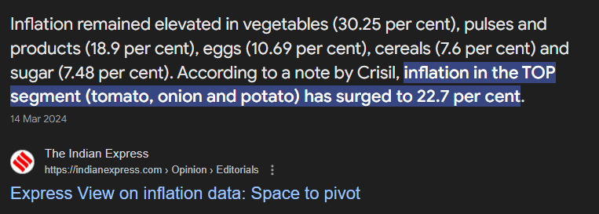
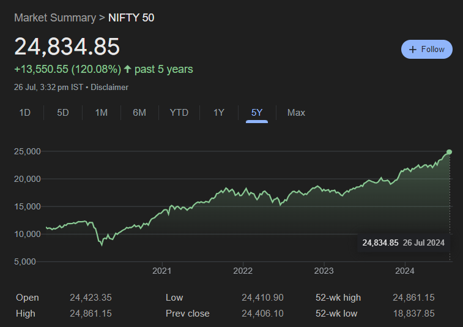

# Learnings Investments

> Before going forward, consider giving this repo a `star` ⭐ because it's a promise that I'll give you all the knowledge I have about investments which can help you a lot!

If you're not investing your money, you're basically losing it! There's no such concept of "saving" money because the money that you keep aside as your savings will decrease it's purchasing power over time due to inflation. 

You must have heard this from a few places, even I did but I never understood the true meaning until I actually played with some numbers.

## Inflation adjusted purchasing power

Ok, so let's assume you have `100,000` INR in your bank account. You're not investing it anywhere, just keeping it in your bank account. Now, let's assume the inflation rate is `5%` per year. 

Now `5%` is not a fixed value, sometimes it's much higher, sometimes it can be lower. Also, inflation can be different in different segments. Some segments have higher inflation rates than others - so you might be facing an inflation rate that is much higher than `5%`, but for now, let's stick to `5%`.

- After 1 year, youe `100,000` will decrease it's purchasing power to `95,000`.
- After 2 years, it will be `90,250`.
- After 3 years, it will be `85,737.5`.
- After 4 years, it will be `81,450.625`.
- After 5 years, it will be `77,378.094`.
- After 6 years, it will be `73,509.189`.
- After 7 years, it will be `69,833.729`.
- After 8 years, it will be `66,342.042`.
- After 9 years, it will be `63,024.94`.
- After 10 years, it will be `59,873.693`.

So, if you try to "save" your money, it will actually reduce to almost half of it's value within the next 10 years. And, this is assuming that the inflation will be just 5%, in reality, inflation can be much higher than 5%.

Let me give you a picture of `Segmental Inflation`, let's come to the basic needs - food. Let's see what was the inflation rate for basic food items in India:

And, if this doesn't scare you, I don't know what will. 

## Why I regret starting so late

Being from an Indian family (I'm going to generalize here a bit), we're not taught about investments. We're taught to save money, keep it in the bank, and that's it. 

Now saving money is important, and most banks (in India) will give you an interest rate of around 3% on savings account and 5-6% on fixed deposits.

To be honest with you, that's not a bad deal, that's good enough to almost stay near inflation levels and not lose much of your purchasing power. But, that's not the best deal either because most of the times these interest rates will be **lower** than inflation levels! (plus the crazy taxes)

I never cared about investments, until I started reading about stock market.

Let's just take a look at the returns of `Nifty 50` index in the last 5 years!

In just 5 years, the index has given a crazy return of 120%!!

Do you know what it means? If - you would have put that `100,000` INR in the Nifty 5 years ago, it would have been `220,000` INR today! 🤑

The sad part is - I did not do that, and I missed the most golden time of Indian stock market.

Year 2022 - 2024 has been a continuous bull run (meaning, majority of investors are buying in the market causing the value of stocks to touch higher highs continuously).

Now, let's just assume for a moment that instead of exact 5 years, if you put that `100,000` INR in the Nifty 50 index during the Covid-19 market crash where the Nifty touched a low of around `8,000` points, your money would have become `3x` today given that Nifty 50 is above `24,000` points! 🤑

Now that looks too good to be true - `100,000` worth of investment becoming `300,000` in just 4 years!

But that's what I said - 2020-2024 has been a golden time for Indian stock market.

- Will it continue to give such good returns? I DON'T KNOW - NOBODY KNOWS
- Is it safe to invest right now? I DOn't KNOW - NOBODY KNOWS
- Will the market crash again? I DON'T KNOW - NOBODY KNOWS
- Will the market go up? I DON'T KNOW - NOBODY KNOWS

There is a possibility that market might go up and down, or it might not give as good returns. But the regret of not having the knowledge of investments and not investing in the market when it there was a golden time is what inspired me to create this repo to document whatever I learn so that others can learn from my knowledge and take informed decisions when it comes to stock market and investments, and use this knowledge to grow their wealth.

## Table of contents

- [Fundamental Analysis](Fundamental_Analysis/README.md)
- Technical Analysis: To be added soon

## Special mentions

Here are a few places from where I'm learning about investments, do check these out:

- [Zerodha Varsity: Introduction to stock markets](https://zerodha.com/varsity/module/introduction-to-stock-markets/)
- [Zerodha Varsity: Fundamental analysis](https://zerodha.com/varsity/module/fundamental-analysis/)
- [Udemy course by Steve Ballinger on stocks investment](https://www.udemy.com/course/investing-in-stocks/?couponCode=KEEPLEARNING)
